# CrowdChain — Decentralized Crowdfunding dApp


A decentralized crowdfunding platform built on Ethereum that enables verified creators to launch fundraising campaigns while ensuring transparency through smart contracts and decentralized storage.

## Table of Contents

- [Features](#features)
- [Tech Stack](#tech-stack)
- [Setup](#setup-one-time-only)
- [Running the Project](#running-the-project--3-commands-total)
- [Deploying to Sepolia](#deploying-to-sepolia-testnet-instead)
- [MetaMask Setup](#metamask-setup-for-localhost)
- [IPFS Setup](#ipfs-setup-pinata)
- [Gas & Performance Analysis](#gas--performance-analysis)
- [Project Structure](#project-structure)
- [Smart Contract Functions](#smart-contract-functions)
- [Screenshots](#screenshots)
- [Performance & Analysis Charts](#performance--analysis-charts)
- [Security Notes](#security-notes)
- [Future Improvements](#future-improvements)
- [License](#license)
 
## Features
 
- Secure Ethereum smart contracts (Solidity)
- Creator verification using community voting (5 upvotes to verify)
- IPFS integration for decentralized document storage (Pinata)
- ETH-based crowdfunding campaigns with editable title/description
- MetaMask wallet integration
- Automatic contract deployment with Hardhat (address auto-written to frontend)
- Refund mechanism for unsuccessful campaigns
- Withdrawal only after funding goals are met and deadline passed
- Built-in gas/performance analysis script
## Tech Stack
 
- Solidity 0.8.20
- Hardhat
- Ethers.js v6
- JavaScript
- HTML/CSS
- MetaMask
- IPFS (Pinata)
- Node.js

                    +----------------+
                    |    MetaMask    |
                    +-------+--------+
                            |
                            v
+--------------------------------------------------+
|               Frontend (HTML/CSS/JS)             |
+-----------------------+--------------------------+
                        |
                        v
                  Ethers.js v6
                        |
                        v
+--------------------------------------------------+
|        Solidity Crowdfunding Smart Contract      |
+-----------------------+--------------------------+
                        |
        +---------------+----------------+
        |                                |
        v                                v
 Ethereum Localhost / Sepolia      IPFS (Pinata)

 ---

## Setup (one time only)
 
```bash
npm install
```
 
---
 
## Running the project — 3 commands total
 
### Terminal 1 — Start local blockchain (keep this open)
```bash
npm run node
```
 
### Terminal 2 — Deploy contract (compiles + deploys + writes address automatically)
```bash
npm run deploy
```
 
### Terminal 2 — Serve the frontend
```bash
npm start
```
 
Then open **http://localhost:3000** in your browser.
 
That's it. No manual copy-pasting of addresses.
 
---
 
## Deploying to Sepolia testnet instead
 
1. Copy `.env.example` to `.env` and fill in:
```
   PRIVATE_KEY=your_metamask_private_key
   SEPOLIA_RPC_URL=https://eth-sepolia.g.alchemy.com/v2/your_key
```
2. Run:
```bash
   npm run deploy:sepolia
   npm start
```
 
Get free Sepolia ETH at: https://sepoliafaucet.com
Get a free RPC at: https://alchemy.com
 
---
 
## MetaMask setup for localhost
 
Add a custom network in MetaMask:
- **RPC URL**: http://127.0.0.1:8545
- **Chain ID**: 31337
- **Currency**: ETH
Import a test wallet by copying a private key from the `npm run node` output.
 
---
 
## IPFS setup (Pinata)
 
1. Sign up free at https://app.pinata.cloud
2. Create an API key (V1)
3. Set your own key/secret in `frontend/app.js`:
```js
   const PINATA_API_KEY    = "your_key";
   const PINATA_SECRET_KEY = "your_secret";
```
 
⚠️ **Do not commit real Pinata keys.** Treat them as secrets — use environment variables or a gitignored config file, and rotate any key that has been shared or committed.
 
---
 
## Gas & performance analysis
 
`scripts/analyze.js` deploys a fresh instance and runs a full flow (application, voting, campaign creation, contribution, withdrawal) against local test accounts, printing gas usage, ETH cost, and timing per function.
 
```bash
npx hardhat run scripts/analyze.js --network localhost
```
 
(Requires `npm run node` running in another terminal first.)
 
---
 
## Project structure
 
```
crowdchain/
├── contracts/
│   └── Crowdfunding.sol         ← Smart contract
├── scripts/
│   ├── deploy.js                ← Deploy + auto-writes address
│   └── analyze.js               ← Gas/performance report
├── frontend/
│   ├── index.html                ← UI
│   ├── style.css                 ← Styles
│   ├── app.js                    ← All client logic (wallet, IPFS, contract calls)
│   └── contract.js               ← ABI + address (auto-updated on deploy)
├── server.js                     ← Tiny static server (npm start)
├── hardhat.config.js
└── package.json
```
 
---
 
## Smart contract functions
 
| Function | Who | Description |
|---|---|---|
| `applyForVerification(hash)` | Anyone | Submit IPFS proof hash |
| `voteOnCreator(addr, bool)` | Anyone (not self) | Upvote or downvote a creator; auto-verifies at 5 upvotes |
| `createCampaign(title, desc, goal, deadline)` | Verified creators | Create a campaign |
| `editCampaign(id, title, desc)` | Creator | Edit title/description (goal & deadline locked) |
| `contribute(id)` | Anyone | Send ETH to a campaign before its deadline |
| `withdrawFunds(id)` | Creator | Withdraw if goal met, after deadline |
| `refund(id)` | Contributors | Refund if goal not met, after deadline |
 
### Read-only helpers
`getCampaignCount`, `getCampaignDetails`, `getCreatorProof`, `getVotes`, `hasVoted`, `getContribution`, `VOTE_THRESHOLD`
 
---
 
## Screenshots
 
<table>
<tr>
<td align="center">
<b>Home Page</b><br>
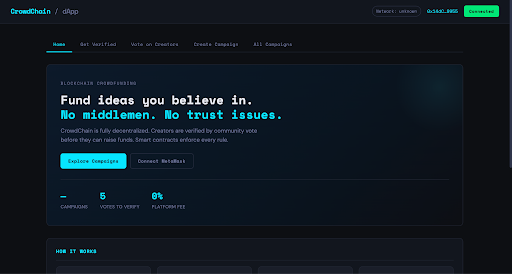
</td>

<td align="center">
<b>How It Works</b><br>
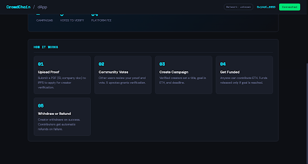
</td>
</tr>

<tr>
<td align="center">
<b>Pending Verification</b><br>
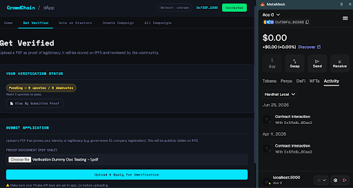
</td>

<td align="center">
<b>Verification Complete</b><br>
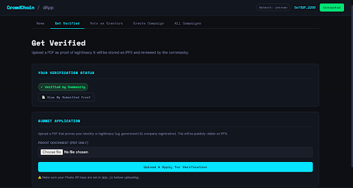
</td>
</tr>

<tr>
<td align="center">
<b>Candidate View</b><br>
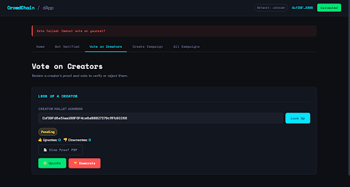
</td>

<td align="center">
<b>User View</b><br>
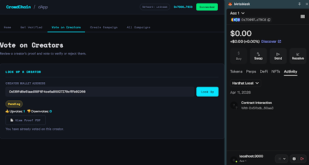
</td>
</tr>

<tr>
<td align="center">
<b>Voter View</b><br>
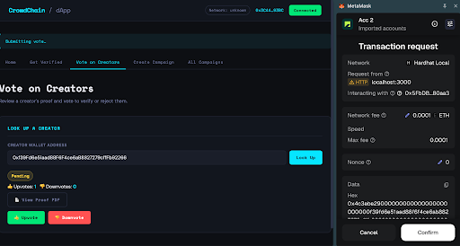
</td>

<td align="center">
<b>Create Campaign</b><br>
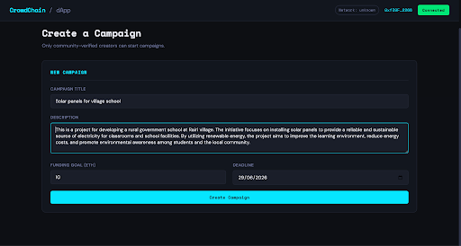
</td>
</tr>
</table>
 
---
 
## Performance & Analysis Charts
 
Generated via `npx hardhat run scripts/analyze.js --network localhost`. <table>
<tr>
<td>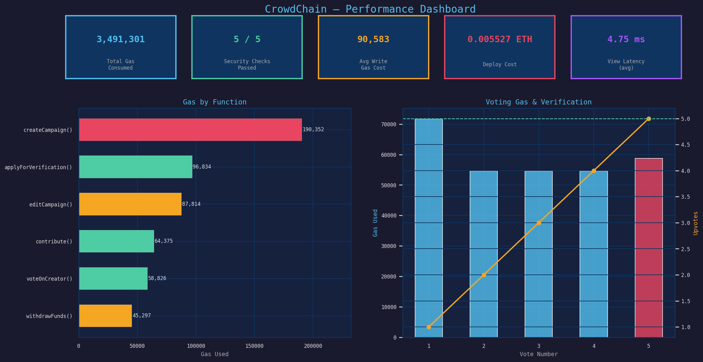</td>
<td>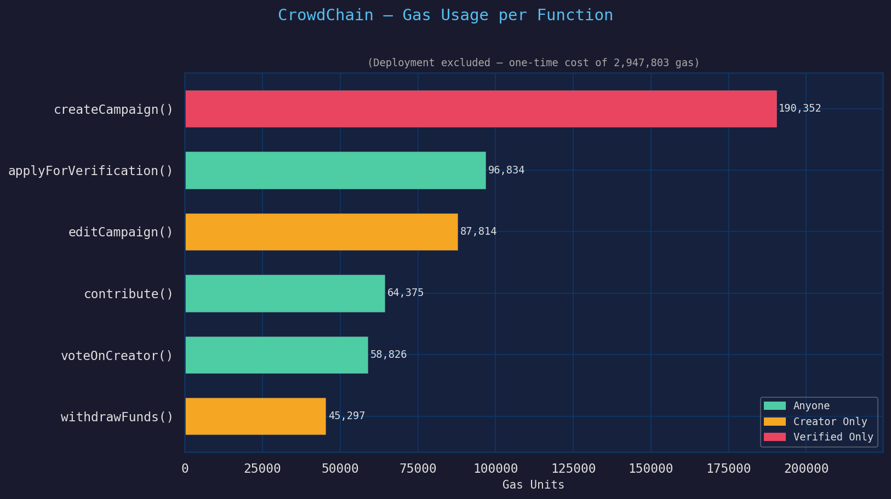</td>
</tr>

<tr>
<td>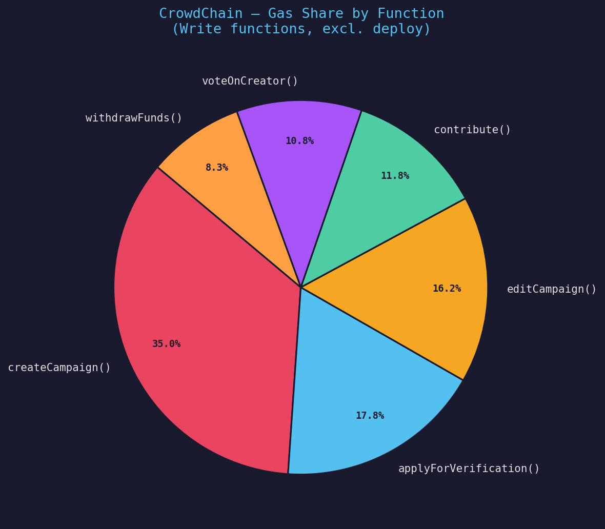</td>
<td>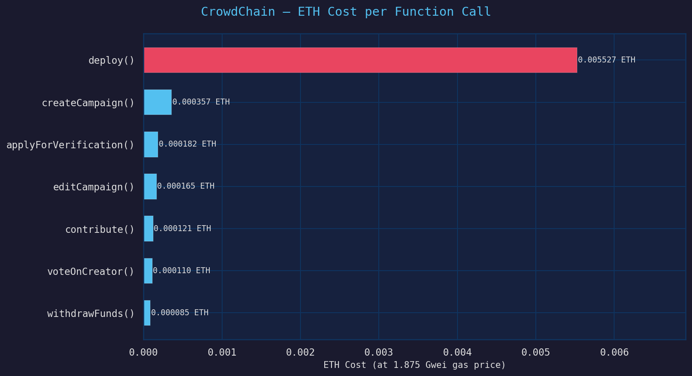</td>
</tr>

<tr>
<td>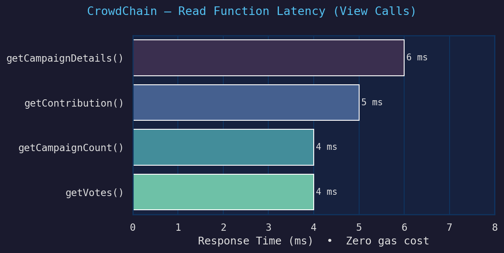</td>
<td>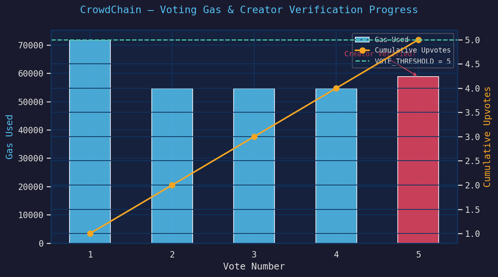</td>
</tr>

<tr>
<td colspan="2" align="center">
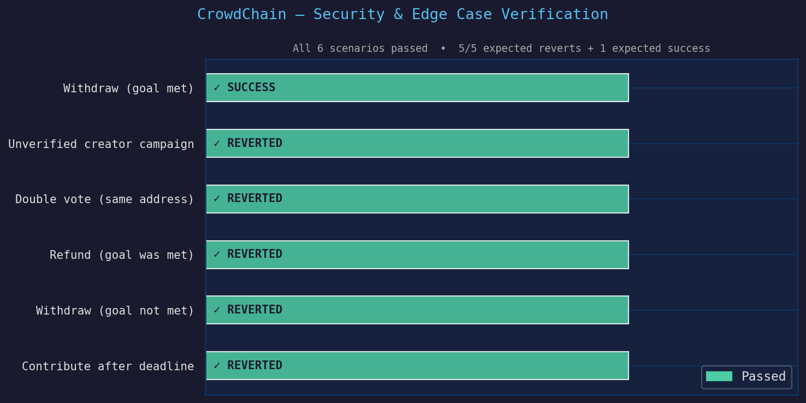
</td>
</tr>
</table> 
---
 
## Security notes
 
- Withdraw/refund follow checks-effects-interactions (state updated before ETH transfer) to prevent reentrancy.
- No admin/owner role — verification is fully community-governed via voting.
- Contract has no pause/emergency-stop mechanism; consider adding one before mainnet use.
- Frontend Pinata keys are client-side and visible to anyone who views source — fine for a local demo, not safe for production as-is.


## What I Learned

- Building secure Ethereum smart contracts using Solidity
- Deploying and testing contracts with Hardhat
- Integrating MetaMask using Ethers.js
- Using IPFS for decentralized document storage
- Measuring gas costs and transaction performance
- Designing a complete end-to-end Web3 application

## Future Improvements

- ERC-20 token donations
- Campaign categories and search
- Milestone-based fund releases
- DAO-based governance
- Backend proxy for secure Pinata uploads
- Mobile-responsive UI enhancements
- Unit and integration tests

## License

This project is licensed under the MIT License. See the `LICENSE` file for details.